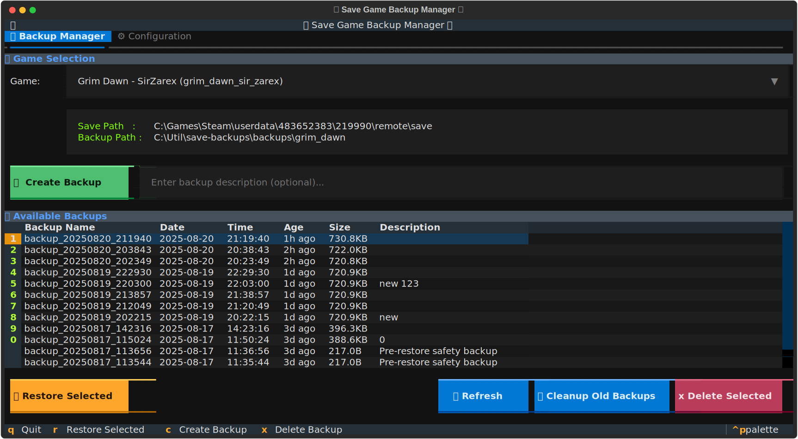

# 🎮 Save Game Backup Manager

A small, dependable utility to back up, restore, and manage game save files on Windows. It supports multiple games, automatic cleanup, descriptive backups, and a choice of interfaces: a CLI/interactive menu and a Textual-based terminal GUI.

## ✨ Key features

- Multi-game support with per-game configuration
- Quick, timestamped backups with optional descriptions
- Restore any backup and pre-restore snapshots for safety
- Automatic cleanup (keep N most recent backups)
- Shared JSON configuration (`games_config.json`) across interfaces
- Works well on Windows (handles read-only files and common path patterns)

## 🚀 Quick start

### Prerequisites

- Python 3.13+  
	(project pyproject.toml requires Python >= 3.13)
- (optional) UV package manager for convenience

### Run

On Windows you can use the bundled batch launcher:

```powershell
.\backup.bat
```

Or run directly:

```powershell
python backup.py
# or, with UV
uv run backup.py
```

On first run the script will create a `games_config.json` template in the repo folder.

## Interfaces

This project provides two main interfaces. Use whichever fits your workflow.

### 1) Interactive CLI (default)

Run `backup.py` or `backup.bat` to get a simple, keyboard-driven menu for:

- Creating backups
- Listing/backing up/restoring/deleting backups
- Managing game configuration (opens a simple config manager)

Examples:

```powershell
# Quick backup for a configured game
uv run backup.py --game grim_dawn --backup

# Backup with a description
uv run backup.py --game grim_dawn --backup -d "Before boss fight"

# Cleanup (keep 5 most recent)
uv run backup.py --game grim_dawn --cleanup --keep 5
```

### 2) Textual TUI (terminal GUI)

The Textual-based terminal UI offers a richer, table-driven experience (tabbed interface, dialogs, progress indicators). This is a first-class interface for users who prefer a GUI-like TUI.


Install Textual and run the TUI:

```powershell
uv add textual
python backup_gui.py
# or use the launcher (Windows)
run_textual_gui.bat
```



Common TUI keys: `q` quit, `r` refresh, `c` create backup, `x` delete, `Tab` navigate, `Enter` activate.

## Configuration

All game and global settings live in `games_config.json`. The file contains a `games` object and `settings` (defaults like `default_max_backups` and `default_backup_path`). The app auto-creates a default file on first run.

You can edit configurations using the interactive config manager (`backup.py --config`) or by editing `games_config.json` directly.

Path expansion supports environment variables (e.g. `%USERPROFILE%`) and `~` home expansion.

## Backup layout & safety

Backups are stored under the `backups/` directory, grouped by game ID, with timestamped subfolders (e.g. `backup_YYYYMMDD_HHMMSS`). Each backup may include a `.backup_description` file if you provided a description.

Safety measures:

- Confirmation required for destructive actions
- Basic validation of paths and read-only file handling on Windows


## Troubleshooting

Permission errors: run as administrator or check folder permissions and close games before operations.

Path issues: verify paths in `games_config.json` and prefer absolute paths where possible.

If backups fail: ensure disk space and check antivirus or open file locks.

For configuration problems: validate `games_config.json` or restore `games_config.json.default`.

## Contributing & License

Contributions welcome: file issues, suggest features, or submit PRs. This project is open source — see the `LICENSE` in the repo.

---

**Happy Gaming! 🎮** Keep your saves safe.
